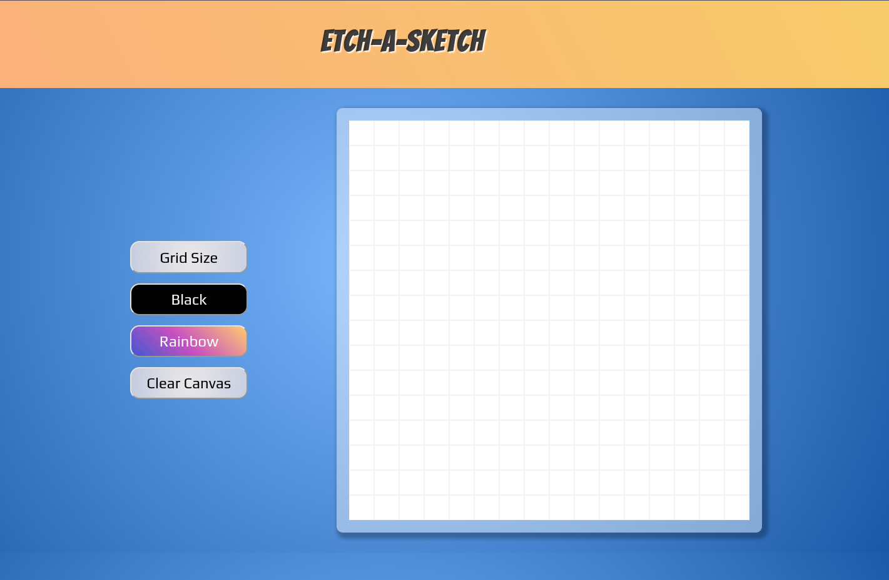
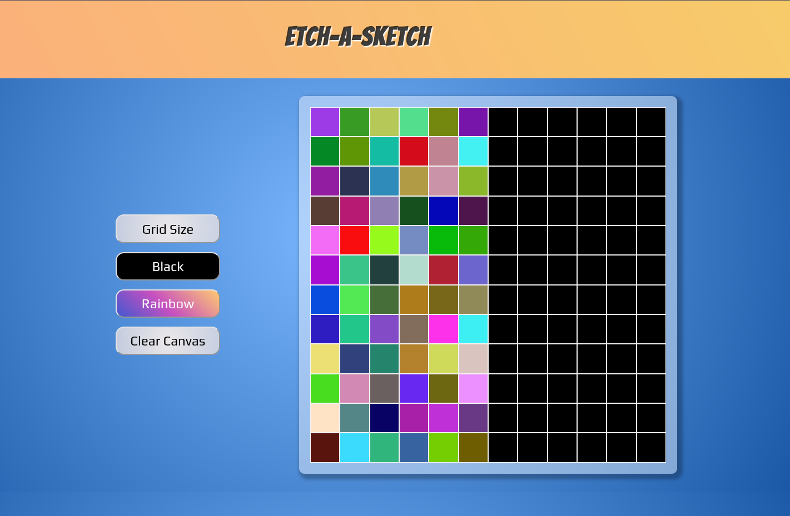

# 🎨 Etch-A-Sketch

A fun and interactive drawing tool inspired by the classic Etch-A-Sketch! Customize your grid size, experiment with different coloring modes, and enjoy the simplicity of flexbox-powered layout.

## 📌 Features

- Adjustable grid size (1x1 to 100x100)
- Mouseover coloring functionality
- Two coloring modes:
  - **Black Mode**: Draw in solid black
  - **Rainbow Mode**: Each hover generates a random color
- Responsive design using Flexbox
- Built with **HTML, CSS, and JavaScript**

## 🚀 How to Use

1. Click the <button>Grid Size</button> button to adjust size (1-100).
2. Hover over the squares to color them.
3. Switch between Black Mode and Rainbow Mode for different effects.
4. Clear the canvas with the <button>Clear Canvas</button> button.

## 🛠️ Technologies Used

- **HTML**: Structure and layout
- **CSS**: Styling, Flexbox for grid arrangement
- **JavaScript**: DOM manipulation, event handling, and dynamic color effects

## 📷 Preview

## 🤝 Credits

This is one of the projects from [The Odin Project](https://www.theodinproject.com/)

## Happy sketching! 🎨✨